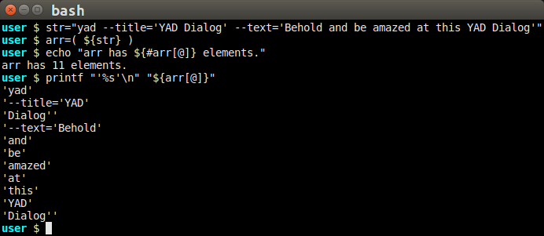

# BASH Arrays

## Creating BASH Arrays

There are several ways to create BASH arrays.  Arrays can be created with the simple `( ... )`
syntax, with the `declare` command, and with the `mapfile` (alias `readarray`) commands.
(The `man` information about these commands will be found in the BASH man page.  Use the
**/** search tool to find the topics.)

The examples in [YAD Arrays](yadarrays.md) used the simple `( ... )` notation.  The following
short example will create an array named *cmd* with three elements:

## Experimenting with BASH Variables

To inexperienced programmers, BASH variable handling can seem very particular.  Look at the
following screen print to see how different syntax results in different outcomes.  The examples
will use `printf "'%s'\n"` to show the results of each string substitution.  Using `printf` this
way will separate the elements makes it easier to see what an array element begins and ends.

### Experiments Converting a String to an Array

This set of experiments will create a string with three elements.  Different handling of the
string will result in differnt outcomes, as will be illustrated below.

#### Create and View the String

#### Create Array from String, Quoted Substitution

You can see that the array only has a single element, not the three we were hoping for.
The problem in this case is that we attempted to create the array from the quoted variable
substitution `arr=( "${str}" )`.  Enclosing the name with quotes forces BASH to treat the
entire string as a single value.

#### Create Array from String, Unquoted Substitution

Using the unquoted substitution, `arr=( ${str} )` results in too many array elements.
The problem is that BASH is breaking the string on white-space characters, specifically
any space, tab, or newline is taken to signal the beginning of a new element.  Even though
the text strings are enclosed in single-quotes, the enclosed spaces trigger new elements.

#### Setting IFS Value for Better Breaks

This is the desired result, an array with three elements.

The **IFS** environment variable dictates how a string is converted to an array.  Any character
in the *IFS* variable will be taken as an element boundary.  The default value of *IFS* of
 `$' \t\n'` means that a space, tab, or newline will begin a new array element.  Also note that
consecutive white space characters will be treated as a single break.

In this example, we have replaced the default *IFS* value with the single newline character,
`IFS=$'\n'` so neither tabs nor spaces will not cause element breaks.  An
important feature of this example is that, by setting *IFS* value on the same line as the
array substitution, the IFS value reverts to the its previous setting when the statement
is finished.

#### Omitting Value String Quotes

Having removed spaces from the list of field separators, we no longer need to use quotes
to keep the sentences together.  

some of the
~~~sh
cmd=(
   yad
   --title="YAD Dialog"
   --text="Behold this YAD dialog and be amazed."
)
~~~

**mapfile** / **readarray** constructs an array from *stdin*.  Creating arrays with this command
is more complicated, but may be called-for if one of the **mapfile** options serve your purposes.
While this function is meant to create an array from a file, this example will simluate a file
by echoing a string that includes newlines.  Notice three 

~~~sh
me:~$ fakefile="yad
> --title='YAD Dialog'
> --text='Behold this YAD dialog and be amazed.'"
me:~$ echo $fakefile | readarray cmd
me:~$ printf "'%s'\n" "${cmd[@]}"
''
me:~$ readarray cmd < <( echo $fakefile )
me:~$ printf "'%s'\n" "${cmd[@]}"
'yad --title='YAD Dialog' --text='Behold this YAD dialog and be amazed.'
'
me:~$ readarray cmd < <( echo "${fakefile}" )
me:~$ printf "'%s'\n" "${cmd[@]}"
'yad
'
'--title='YAD Dialog'
'
'--text='Behold this YAD dialog and be amazed.'
'
me:~$ readarray -t cmd < <( echo "${cmdstr}" )
me:~$ printf "'%s'\n" "${cmd[@]}"
'yad'
'--title='YAD Dialog''
'--text='Behold this YAD dialog and be amazed.''
me:~$ 

me:~/yaddemo$ cmdstr="yad
> --title='YAD Dialog'
> --text='Behold this YAD dialog and be amazed'"
me:~/yaddemo$ echo $cmdstr | readarray cmd
me:~/yaddemo$ echo "${cmd[@]}"

me:~/yaddemo$ readarray cmd < <( echo $cmdstr )
me:~/yaddemo$ echo "${cmd[@]}"
yad --title='YAD Dialog' --text='Behold this YAD dialog and be amazed'

cmdstr="yad
--title='YAD Dialog
--text='Behold this YAD dialog and be amazed.'"

mapfile cmd < <( echo $cmdstr )
~~~